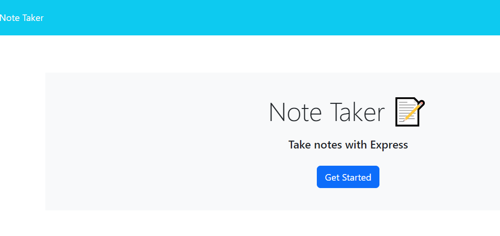
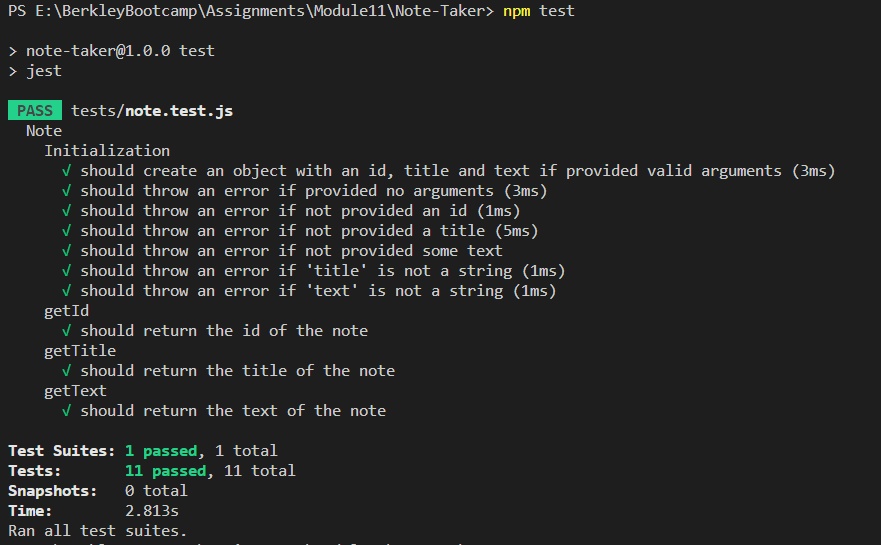

# Note-Taker
Note Taker is an application that can be used to write and save notes. This application will use an Express.js back end and will save, delete and retrieve note data from a JSON file.  The entire application is deployed on Heroku.

## Description
Note Take application will help the user to keep tracks of their tasks.  The user will be able to write and save their notes, delete a note when the related task is completed.  The application displays all the saved notes in a list to review them as needed.  Here are the features of this application:

1. When the user opens the Note Taker, they are presented with a landing page with a link to a notes page.
2. When the user clicks on the link to the notes page, they are presented with a page with existing notes listed in the left-hand column, plus empty fields to enter a new note title and the note’s text in the right-hand column.
3. When the user enters a new note title and the note’s text, a Save icon appears in the navigation at the top of the page.
4. When the user clicks on the Save icon, the new note they have entered is saved and appears in the left-hand column with the other existing notes.
5. When the user clicks on an existing note in the list in the left-hand column that note appears in the right-hand column.
6. When the user clicks on the Write (+) icon in the navigation at the top of the page, they are presented with empty fields to enter a new note title and the note’s text in the right-hand column
7. When the user clicks on the delete icon next to a note in the left-hand column, the note is deleted from the lsit and storage and the page refreshes with the current list.

## Technology Used

* Uses the [Express package](https://www.npmjs.com/package/express).
* Uses the [Jest package](https://www.npmjs.com/package/jest) for a suite of unit tests.
* Uses the [uuid package](https://www.npmjs.com/package/uuid)

* The application has `Note` class stored in 'lib' folder.
* The associated tests for `Note` class are in 'tests' folder.

* On the back end, the application uses `db.json` file that is used to store and retrieve notes using the `fs` module.
* The following HTML routes should be created:
  * `GET /notes` returns the `notes.html` file.
  * `GET *` return the `index.html` file.
  * There is a wildcard route to catch anything not handled and returns a `404.html` file
* The following API routes should be created:
  * `GET /api/notes` reads the `db.json` file and return all saved notes as JSON.
  * `POST /api/notes` receives a new note to save on the request body, add it to the `db.json` file, and then return the new note to the client. Each note is given a unique id when it's saved using `uuid` package.
  * `DELETE /api/notes/:id` receives a query parameter that contains the id of a note to delete. To delete a note, the application reads all notes from the `db.json` file, removes the note with the given `id` property, and then rewrite the notes to the `db.json` file.


## Mock-Up

Demo of Project: [Note Taker Demo on Google Drive](https://drive.google.com/file/d/1zS6-PRnanHBZPDaURr3w0L2n-qW9iEdV/view?usp=share_link) 
                  OR [MP4 Demo File in Project](./public/assets/images/Note-Taker.mp4)

The following images show the web application's appearance and functionality:



Test Screenshot:



## Usage
1. You can access the file in GitHub repository: https://github.com/rbhumbla1/Note-Taker
2. Run the application deployed on heroku using this url: 

## License
None

## Contributing

Contact owner

## Tests

  To run tests, please run the following command:
  ```
  npm test
  ```

## Questions

  If you have any questions about the repository and project, or would like to open an issue or would like to contact me for contributing or any other subject, you can do so at rima.bhumbla@gmail.com. You can welcome to see more of my work at https://github.com/rbhumbla1.